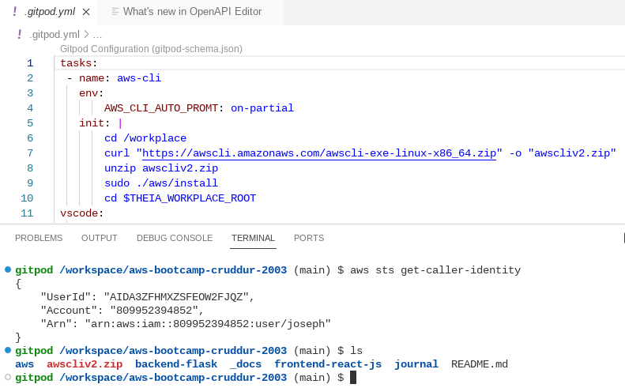
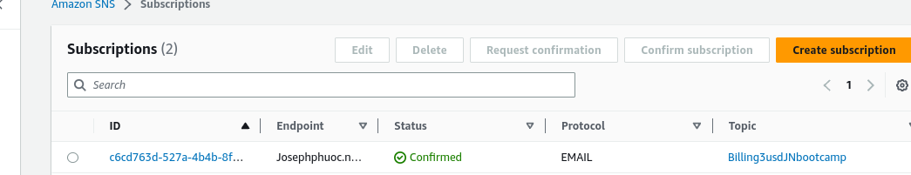
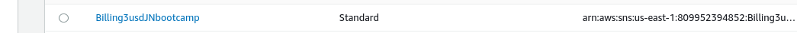

# Week 0 — Billing and Architecture
- update gipod.yml file: following this link [link install aws cli linux](https://docs.aws.amazon.com/cli/latest/userguide/getting-started-install.html)

  
  
- yml online editor [check yml file](https://codebeautify.org/yaml-editor-online)
  
- the link to aws cli references [aws cli references](https://docs.aws.amazon.com/cli/latest/index.html)

- howto update journal [andrew guide](https://www.youtube.com/watch?v=mWaSBRJhUFM&list=PLBfufR7vyJJ7k25byhRXJldB5AiwgNnWv&index=19) and [markdown references](https://www.markdownguide.org/basic-syntax/)

- biling and alert on aws created 
  
   
- Lucid Chart
